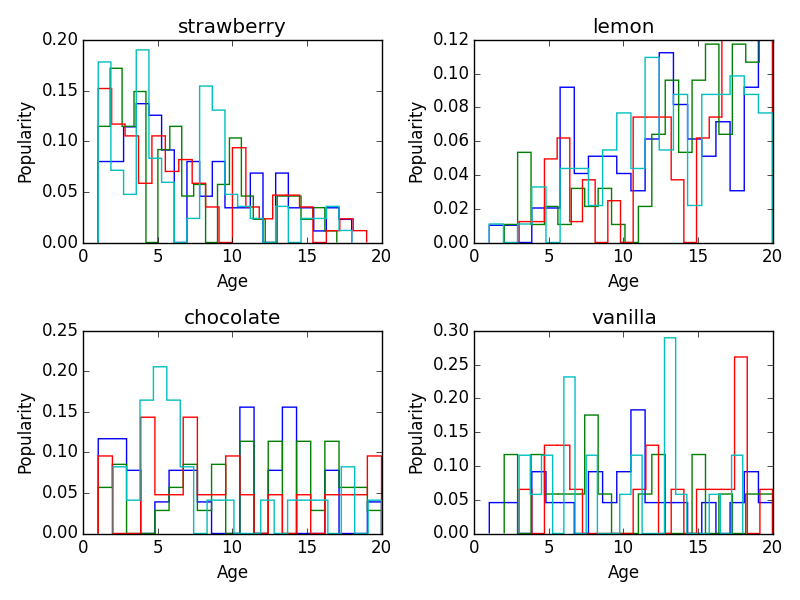

# cat-icecream

[](https://travis-ci.org/BillMills/cat-icecream)

#### Release History

Version | DOI
--------|-----
0.1.0   | [](https://zenodo.org/badge/latestdoi/3877/BillMills/cat-icecream)

## Introduction

This repository contains the analysis code used to produce the analysis for [our forthcoming paper](), studying the ice cream preferences of cats as a function of age and coat coloration. The key results from this paper are summarized in the following figure:



As the figure illustrates, cats prefer chocolate and vanilla ice cream at roughly constant rates throughout their lives, but among fruit-flavored ice creams, evidence exists to suggest preferences shift from strawberry to lemon as cats age. No compelling evidence for a correlation between coat and flavor preference is found.

## Other Resources

In addition to the code in this repo, this cat-icecream analysis relies on several other resources:

 - **Dependencies** are managed through a Docker image available on Dockerhub, [billmills/cat-icecream](https://hub.docker.com/r/billmills/cat-icecream/)
 - **Data** is [available on FigShare](https://figshare.com/articles/cat_icecream_dataset/2059248/1), DOI 10.6084/m9.figshare.2059248.v1

## Running cat-icecream

In order to reproduce this analysis, please follow the following steps; if anything doesn't work, please [open an issue](https://github.com/BillMills/cat-icecream/issues), and we will help clarify.

### Software Prerequisites

 - [git](https://git-scm.com/book/en/v2/Getting-Started-Installing-Git) (for cloning this repository), or alternatively, download the zipped code by following the DOI links above.
 - [Docker](https://www.docker.com/), for managing dependencies. Alternatively, see `Dockerfile` in this repo for a description of the dependencies found in our Docker image; *use of the project's Docker image is highly recommended rather than attempting to install dependencies natively*.

### Setup & Execution

Once git and Docker are installed and functioning, follow these steps to reproduce the analysis:

 - Clone this repository to your computer: `git clone https://github.com/BillMills/cat-icecream.git`. Or, unzip the zipped code archive you can download by following the DOI links above.
 - Pull the Docker image from dockerhub: `docker pull billmills/cat-icecream`. Note you may have to start your Docker environment to do this; Docker provides [tutorials](https://docs.docker.com/mac/) on basic Docker usage for new users.
 - [Download the data](https://ndownloader.figshare.com/files/3639051) and save it as `data/cat-data.csv`.
 - Launch your Docker container from within the `cat-icecream` directory, and mount that directory within your container:
```
cd cat-icecream
docker run -v $PWD:/cat-icecream -i -t billmills/cat-icecream /bin/bash 
```
 - You're now inside the Docker container and ready to run; to run the script:
```
cd /cat-icecream
python cat-icecream.py
```
 and `img/cat-icecream.png` will be re-generated. Or, to run the tests, also from the `/cat-icecream` directory:
```
nosetests tests/*.py
```

## Programmatic Logic

cat-icecream follows a simple programmatic flow:


Data in `data/cat-data.csv` is ingested by pandas into a dataframe, and the helper function `getAges` extracts lists of ages matching a specified color and flavor preference. matplotlib then generates the final histograms of these lists of ages.

## Contributing

Contributions to this analysis are very welcome! To begin with, please go through the steps in the [Running cat-icecream](https://github.com/BillMills/cat-icecream#running-cat-icecream) section above, so you're comfortable using all the bits and pieces. Then, if you would like to suggest a change or update to the project, please follow these steps:

 - Open an issue to discuss your ideas with us.
 - Please limit each pull request to less than 500 lines.
 - Please encapsulate all new work in short functions (less than 50 lines each), and write at least one unit test for each of those functions.
 - Please ensure all tests (new and old) pass before signing off on your contribution.
 - Do something nice for yourself! You just contributed to this research, and we really appreciate you taking the time to check it out and get involved.

The most important step is the first one: open that issue to start a conversation, and we can offer help on any of the other points if you get stuck. 
